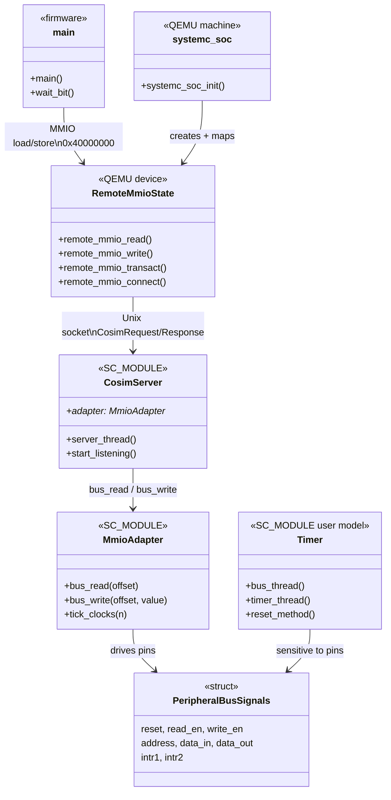
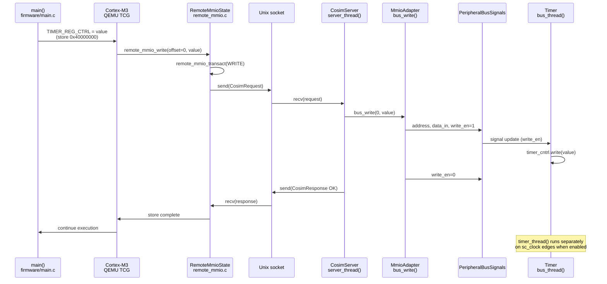
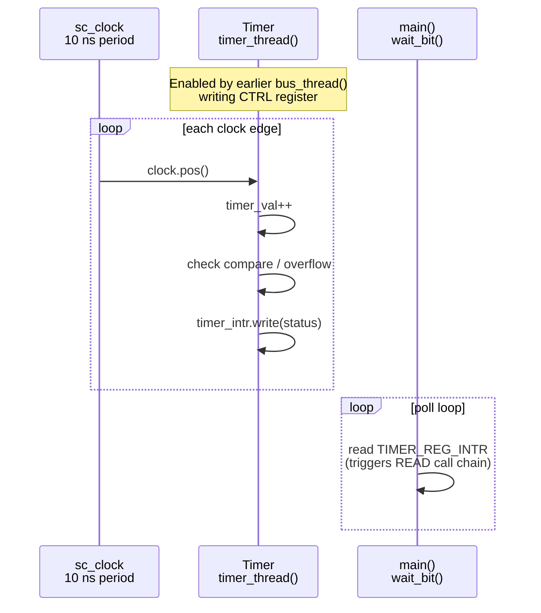

# ⏱️ SystemC Memory-Mapped Timer Peripheral Model

A reusable **SystemC/C++ timer peripheral** that models the behavior of a programmable hardware timer commonly found in modern SoCs. The project demonstrates how embedded peripherals are designed, modeled, and integrated into a virtual platform for pre-silicon software development and architectural exploration.

Rather than implementing just an 8-bit counter, this project models the **complete lifecycle of a hardware peripheral** including register abstraction, memory-mapped I/O, interrupt generation, reset behavior, clock-driven execution, and software interaction.

---

# Why This Project?

Almost every modern SoC contains multiple hardware timers.

They are used by:

* Operating Systems (Linux, RTOS)
* Bootloaders
* Task Scheduling
* Delay Generation
* Timeout Detection
* Watchdog Timers
* Communication Protocols
* PWM Controllers
* Input Capture Modules
* Real-Time Applications

Before RTL becomes available, software teams still need to develop firmware, drivers, bootloaders, and operating systems. Virtual platform models built using **SystemC/TLM** enable software development months before silicon is fabricated.

This project demonstrates the development of one such reusable peripheral model.

---

# Real World Use Cases

A programmable timer is one of the most fundamental peripherals inside an SoC.

Typical applications include:

### Operating System Tick Timer

Generates periodic interrupts used by Linux or an RTOS scheduler.

```
CPU
 │
 │ 1 ms Tick
 ▼
Timer
 │
 ▼
Interrupt
 │
 ▼
Scheduler
```

---

### Timeout Detection

Used for communication protocols.

Examples:

* UART timeout
* Ethernet timeout
* SPI timeout
* I2C timeout

---

### Delay Generation

Instead of software busy loops:

```
Configure Timer

↓

Start Timer

↓

Wait for Interrupt

↓

Continue Execution
```

---

### Performance Measurement

Measure execution latency.

Example:

```
Start Timer

↓

Execute Function

↓

Read Timer

↓

Execution Cycles
```

---

### Event Scheduling

Many peripherals trigger future events using programmable compare values.

Examples:

* DMA
* PWM
* Audio
* Display Controllers

---

# Features

✔ Memory-mapped register interface

✔ Configurable timer enable

✔ Compare match functionality

✔ Overflow detection

✔ Interrupt generation

✔ Register abstraction

✔ Clock-driven execution

✔ Reset handling

✔ Read/Write register access

✔ Modular SystemC implementation

✔ Easily extendable architecture

---

# Timer in a Virtual SoC

```text
                    +----------------------+
                    |        CPU           |
                    +----------+-----------+
                               |
                               |
                     Memory-Mapped Bus
                               |
        ------------------------------------------------
        |         |         |         |                |
      UART      Timer      GPIO      SPI            Ethernet
        |         |         |         |                |
        ------------------------------------------------
                               |
                     Interrupt Controller
                               |
                              CPU
```

In a virtual platform, software running on a virtual CPU accesses peripherals exactly as it would on real silicon.

The timer behaves like an actual hardware IP, allowing firmware developers to validate software before RTL or FPGA prototypes are available.

---

# Virtual SoC Simulation Blueprint (QEMU + SystemC)

This section is the architecture-level blueprint of how the **user SystemC Timer** is simulated together with a **virtual SoC** built around **QEMU (ARM Cortex-M3)**.

The key design rule: **peripheral behavior stays in SystemC**. QEMU provides the CPU, memories, and a generic MMIO bridge. A thin wrapper connects the two. No Timer logic is re-implemented inside QEMU.

## 1. What is being simulated?

Two cooperating simulators form one virtual SoC:

| Process | Role | Owns |
|--------|------|------|
| **QEMU** (`qemu-system-arm -M systemc-soc`) | Instruction-accurate CPU + address map | Cortex-M3, Flash, SRAM, NVIC, `remote-mmio` bridge |
| **SystemC** (`cosim_platform`) | Cycle/event-accurate peripheral | User `Timer` model, `sc_clock`, bus adapter, cosim server |

Baremetal firmware runs **on the QEMU CPU** and programs the Timer **exactly as MMIO**, the same way software would on silicon. Every access to the Timer window is forwarded into SystemC, where the real model executes.

```text
 ┌─────────────────────────────────────────────────────────────────────────┐
 │                        HOST MACHINE (macOS / Linux)                      │
 │                                                                          │
 │   Process A: QEMU                         Process B: SystemC             │
 │  ┌──────────────────────────────┐        ┌────────────────────────────┐ │
 │  │  Virtual SoC (systemc-soc)   │        │  Cosim platform            │ │
 │  │                              │        │                            │ │
 │  │  Cortex-M3 CPU (TCG)         │        │  sc_clock (10 ns)          │ │
 │  │       │                      │        │       │                    │ │
 │  │       ▼                      │        │       ▼                    │ │
 │  │  System bus / address space  │        │  MmioAdapter (pin wiggles) │ │
 │  │   ├─ Flash  @ 0x00000000     │        │       │                    │ │
 │  │   ├─ SRAM   @ 0x20000000     │        │       ▼                    │ │
 │  │   └─ Bridge @ 0x40000000 ────┼─Unix───┼─► CosimServer              │ │
 │  │        remote-mmio           │ socket │       │                    │ │
 │  │                              │        │       ▼                    │ │
 │  │  NVIC (IRQ lines reserved)   │        │  USER MODEL: Timer         │ │
 │  │                              │        │  (Timer/timer.h as-is)     │ │
 │  └──────────────────────────────┘        └────────────────────────────┘ │
 │                                                                          │
 │  Guest software: firmware/timer_fw.elf (loaded into Flash)               │
 └─────────────────────────────────────────────────────────────────────────┘
```

## 2. SoC block diagram (as seen by software)

From the baremetal programmer’s point of view, this is a small Cortex-M microcontroller-class SoC:

```text
                         systemc-soc virtual chip
 +-----------------------------------------------------------------------+
 |                                                                       |
 |   +-------------+     system address space                            |
 |   | Cortex-M3   |--------------------------------------------------+  |
 |   | CPU + NVIC  |                                                  |  |
 |   +------+------+                                                  |  |
 |          | ICode / DCode / System bus                              |  |
 |          |                                                         |  |
 |   +------v------+   +-------------+   +--------------------------+ |  |
 |   | Flash (ROM) |   | SRAM (RAM)  |   | remote-mmio window       | |  |
 |   | 512 KiB     |   | 128 KiB     |   | 4 KiB @ 0x40000000       | |  |
 |   | 0x0000_0000 |   | 0x2000_0000 |   | (appears as Timer regs)  | |  |
 |   +-------------+   +-------------+   +-------------+------------+ |  |
 |                                                     |               |  |
 +-----------------------------------------------------|---------------+  |
                                                       |                  
                                                       | cosim protocol   
                                                       v                  
                                              +------------------+        
                                              | SystemC Timer IP |        
                                              | (true model)     |        
                                              +------------------+        
```

Software never “knows” SystemC exists. It only sees a memory-mapped peripheral at `0x40000000`.

## 3. CPU

| Attribute | Value |
|-----------|--------|
| ISA / profile | ARMv7-M (Thumb-2) |
| Core | **ARM Cortex-M3** |
| Emulator | QEMU TCG (`qemu-system-arm`) |
| Machine name | `systemc-soc` |
| Exception model | NVIC inside QEMU `TYPE_ARMV7M` container |
| External IRQs | Up to 64 lines; bridge IRQ0/IRQ1 wired for future use |
| Boot | Vector table at Flash `0x00000000`; `-kernel timer_fw.elf` |

The CPU fetches instructions from Flash, uses SRAM for stack/data, and performs load/store to `0x40000000` for Timer registers.

There is **no OS** in the default flow — only freestanding baremetal firmware with ARM semihosting for `printf`-style output and exit.

## 4. Memory map

| Region | Base | Size | Implemented in | Contents |
|--------|------|------|----------------|----------|
| **Flash / Code** | `0x00000000` | 512 KiB | QEMU ROM | Vector table, `.text`, `.rodata` from `timer_fw.elf` |
| **SRAM** | `0x20000000` | 128 KiB | QEMU RAM | `.data`, `.bss`, stack (`_estack` at top of SRAM) |
| **Timer window** | `0x40000000` | 4 KiB | QEMU `remote-mmio` → SystemC | Forwarded offsets `0x00…0x0C` into user Timer |
| **Private Peripherals** | `0xE0000000` | — | QEMU ARMv7-M | NVIC, SysTick, etc. (standard Cortex-M map) |

### Timer register view inside the bridge window

Offsets are **identical** to the SystemC model (`Timer/timer.h`):

| Offset | Register | Firmware symbol | Meaning |
|--------|----------|-----------------|---------|
| `+0x00` | Control | `TIMER_REG_CTRL` | bit0 ENABLE, bit1 CMP_EN, bit2 OV_EN |
| `+0x04` | Value | `TIMER_REG_VALUE` | current count |
| `+0x08` | Compare | `TIMER_REG_CMP` | compare threshold |
| `+0x0C` | Interrupt | `TIMER_REG_INTR` | bit1 CMP pending, bit2 OV pending |

Absolute example: compare register = `0x40000008`.

## 5. How Timer interacts with QEMU (end-to-end path)

Example: firmware writes `TIMER_REG_CTRL = ENABLE | CMP_EN | OV_EN`.

```text
1. Firmware (Thumb code on Cortex-M3)
      STR  rX, [0x40000000]          // store to Control register

2. QEMU CPU / memory core
      Address 0x40000000 hits remote-mmio MemoryRegion

3. remote-mmio device (QEMU side, NO timer logic)
      Build CosimRequest { op=WRITE, addr=0x0, data=ctrl }
      send() on Unix socket  (/tmp/systemc_cosim.sock by default)
      block until CosimResponse

4. CosimServer (SystemC SC_THREAD)
      recv request
      call MmioAdapter::bus_write(0x0, ctrl)

5. MmioAdapter (wrapper only)
      drive pins: address, data_in, write_en=1
      wait delta / one clock period

6. User Timer model (SystemC)
      bus_thread sees write_en
      timer_cntrl.write(ctrl)     // REAL model state update

7. Response path
      CosimServer -> CosimResponse { status=OK }
      remote-mmio completes the store
      Cortex-M3 continues to next instruction
```

Read path is symmetric (`COSIM_OP_READ`): firmware `LDR` → bridge → adapter `bus_read` → Timer `data_out` → value returned to CPU register.

### Clock / time advancement

- SystemC owns `sc_clock` at **10 ns** period.
- While QEMU is idle on the socket, `CosimServer` still advances simulation time (poll slice), so the Timer’s `timer_thread` can increment on clock edges.
- Each MMIO access also advances at least one clock period in the adapter so the model progresses under heavy register traffic.

So: **CPU time** is QEMU guest time; **peripheral time** is SystemC time. They are loosely synchronized at MMIO and idle-poll boundaries (functional cosimulation, not cycle-locked RTL cosim).

## 6. Class & Function Call Chain — Who Calls the Timer?

This section answers: **which classes and functions actually reach the user `Timer` model**, and in what order.

### 6.1 Object hierarchy (SystemC side)

The Timer is **never called directly from QEMU**. It is reached only through SystemC signals wired in `sc_main`:

```text
sc_main()                          [platform/cosim_main.cpp]
  │
  ├── sc_clock              clk
  ├── PeripheralBusSignals  bus          (shared signal bundle)
  ├── Timer                 dut          ← USER MODEL (Timer/timer.h)
  ├── MmioAdapter           adapter      (wrapper/mmio_adapter.h)
  └── CosimServer           server       (wrapper/cosim_server.cpp)
        server.adapter ───────────────► &adapter
```

Wiring functions (called once at startup):

| Function | File | What it connects |
|----------|------|------------------|
| `bind_peripheral(dut, clk, bus)` | `wrapper/peripheral_if.h` | `Timer` ports ↔ `PeripheralBusSignals` |
| `bind_adapter(adapter, bus)` | `wrapper/mmio_adapter.h` | `MmioAdapter` outputs ↔ same bus signals |
| `server.adapter = &adapter` | `platform/cosim_main.cpp` | `CosimServer` holds pointer to adapter |

After binding, `MmioAdapter` and `Timer` share the same `read_en`, `write_en`, `address`, `data_in`, `data_out` signals. The adapter drives the bus; the Timer reacts.

### 6.2 Class diagram (QEMU + SystemC)



### 6.3 Complete call chain (WRITE example)

Firmware assignment `TIMER_REG_CTRL = value` expands to a store to `0x40000000`:

| Step | Layer | Class / Unit | Function | Calls next |
|------|-------|--------------|----------|------------|
| 1 | Guest SW | — | `main()` | writes `TIMER_REG_CTRL` macro |
| 2 | Guest SW | — | `TIMER_REG_CTRL` | `*(volatile uint32_t*)0x40000000 = value` |
| 3 | QEMU CPU | TCG / memory | (CPU store) | dispatches to MMIO region |
| 4 | QEMU device | `RemoteMmioState` | `remote_mmio_write()` | `remote_mmio_transact(WRITE, …)` |
| 5 | QEMU device | `RemoteMmioState` | `remote_mmio_transact()` | `send()` CosimRequest on socket |
| 6 | SystemC | `CosimServer` | `server_thread()` | `recv()` request |
| 7 | SystemC | `CosimServer` | `server_thread()` | `adapter->bus_write(addr, data)` |
| 8 | SystemC | `MmioAdapter` | `bus_write()` | drives `address`, `data_in`, `write_en` signals |
| 9 | SystemC | `Timer` | `bus_thread()` | wakes on `write_en` edge |
| 10 | SystemC | `Timer` | `bus_thread()` | `timer_cntrl.write(data_in.read())` for offset `0x0` |

**Inside the Timer model** (after step 10), these methods run independently on their own sensitivity:

| Method | Trigger | Role |
|--------|---------|------|
| `bus_thread()` | `read_en`, `write_en` | Register read/write decode |
| `timer_thread()` | `clock.pos()` | Increment counter, compare, overflow |
| `reset_method()` | `reset` | Clear registers and state |

The **only entry point from QEMU into the Timer** is `Timer::bus_thread()` (via signal changes from `MmioAdapter::bus_write` / `bus_read`). QEMU never calls `timer_thread()` directly; that runs on `sc_clock` edges once the control register enables the timer.

### 6.4 Complete call chain (READ example)

Firmware read `TIMER_REG_INTR` (`0x4000000C`):

```text
main()
  └─► wait_bit(&TIMER_REG_INTR, …)     // polls INTR register
        └─► volatile load @ 0x4000000C
              └─► QEMU: remote_mmio_read()
                    └─► remote_mmio_transact(READ, addr=0xC)
                          └─► CosimServer::server_thread()
                                └─► MmioAdapter::bus_read(0xC)
                                      └─► drives read_en, address
                                            └─► Timer::bus_thread()
                                                  └─► data_out.write(timer_intr.read())
                                                        └─► value returned up the chain
```

### 6.5 Sequence diagram (MMIO write → Timer)



### 6.6 Sequence diagram (Timer counting in background)

While firmware polls `TIMER_REG_INTR`, the counter advances without further MMIO writes:



### 6.7 QEMU machine setup (where the bridge is created)

`systemc_soc_init()` in `qemu_soc/qemu/systemc_soc.c` builds the virtual chip. It does **not** know about Timer — only the bridge:

| Function | Creates | Purpose |
|----------|---------|---------|
| `systemc_soc_init()` | Flash @ `0x00000000` | Code region for firmware |
| `systemc_soc_init()` | SRAM @ `0x20000000` | Stack / data |
| `systemc_soc_init()` | `TYPE_ARMV7M` | Cortex-M3 + NVIC |
| `systemc_soc_init()` | `TYPE_REMOTE_MMIO` | Socket bridge @ `0x40000000` |
| `systemc_soc_init()` | `armv7m_load_kernel()` | Load `timer_fw.elf` into Flash |

### 6.8 Summary: direct vs indirect callers of Timer

| Caller | Directly invokes Timer method? | How it reaches Timer |
|--------|-------------------------------|----------------------|
| `main()` (firmware) | No | MMIO store/load → QEMU → socket → adapter → signals |
| `RemoteMmioState` | No | Socket only; no SystemC awareness |
| `CosimServer` | No | Calls `MmioAdapter::bus_read/write` |
| `MmioAdapter` | No | Toggles `read_en`/`write_en`/`address`/`data_in` signals |
| `Timer::bus_thread()` | **Yes** | Reads/writes `timer_cntrl`, `timer_val`, `timer_cmp`, `timer_intr` |
| `Timer::timer_thread()` | **Yes** (internal) | Runs on clock; updates counter and interrupt register |
| `Timer::reset_method()` | **Yes** (internal) | Clears state when `reset` signal is high |

**Bottom line:** The user `Timer` class is instantiated only in `sc_main()` (`cosim_main.cpp`). The **only external stimulus** into the model is through `MmioAdapter` driving the shared bus signals, which activates `Timer::bus_thread()`. All timer counting behavior is internal to `Timer::timer_thread()`.

## 7. Component responsibilities (who owns what)

```text
+----------------------+----------------------------------------------+
| Component            | Responsibility                               |
+----------------------+----------------------------------------------+
| firmware/            | Guest SW: program Timer via MMIO, check INTR |
| qemu/systemc_soc.c   | Instantiate CPU, Flash, SRAM, map bridge     |
| qemu/remote_mmio.*   | Generic MMIO <-> socket proxy                |
| protocol/            | Binary packet format (READ/WRITE/TICK/QUIT)  |
| wrapper/             | Drive user pin interface; no peripheral math |
| platform/cosim_main  | Wire YOUR Timer into wrapper + start server  |
| Timer/timer.h        | The only Timer behavioral model              |
+----------------------+----------------------------------------------+
```

### Pin interface the wrapper expects

Any future user peripheral can replace Timer if it exposes:

```text
clock, reset, read_en, write_en, data_in, address, data_out, intr1, intr2
```

Documented in `qemu_soc/wrapper/peripheral_if.h`.

## 8. Cosimulation protocol (bridge contract)

Transport: **Unix domain stream socket** (default `/tmp/systemc_cosim.sock`, override with `SYSTEMC_COSIM_SOCKET`).

Request / response (little-endian, packed):

```text
CosimRequest:  magic | version | op | addr | data
CosimResponse: magic | version | status | data
```

| `op` | Meaning |
|------|---------|
| `READ` | `addr` = byte offset in window; response `data` = read value |
| `WRITE` | `addr` + `data` written into model |
| `TICK` | advance N SystemC clocks (optional sync aid) |
| `QUIT` | tear down cosim |

Magic = `SCM1`. This protocol is intentionally peripheral-agnostic.

## 9. Boot and run sequence

```text
run_cosim.sh
   │
   ├─1─ make firmware/timer_fw.elf
   ├─2─ make platform/cosim_platform
   ├─3─ start cosim_platform (listen on socket; Timer comes out of reset)
   └─4─ start qemu-system-arm
            -M systemc-soc -cpu cortex-m3
            -kernel timer_fw.elf
            -semihosting-config enable=on,target=native
            -nographic
```

Inside QEMU after reset:

1. Cortex-M3 loads SP / PC from Flash vector table  
2. `Reset_Handler` copies `.data`, zeros `.bss`, calls `main`  
3. `main` writes Timer registers through `0x40000000`  
4. Each access is fulfilled by the live SystemC Timer  
5. Firmware polls interrupt status bits and prints PASS/FAIL via semihosting  

## 10. Two simulation modes in this repo

| Mode | Command | CPU | Timer implementation |
|------|---------|-----|----------------------|
| **SystemC-only TB** | build/run `Timer/timer_tb.cpp` | Stimulus thread in SystemC | User Timer |
| **Virtual SoC cosim** | `qemu_soc/scripts/run_cosim.sh` | QEMU Cortex-M3 + baremetal | Same user Timer via bridge |

Use the testbench to verify the IP in isolation. Use cosim to verify **software + SoC integration**.

## 11. Design intent / non-goals

**Intent**

* Keep user models authoritative (single source of truth in SystemC)
* Provide a reusable QEMU bridge + wrapper for future peripherals
* Let baremetal / drivers develop against a real MMIO map early

**Non-goals (current)**

* Cycle-accurate lockstep between QEMU TCG and SystemC clocks  
* Full production IRQ back-propagation (lines are reserved; firmware currently polls `INTR`)  
* Modeling UART/GPIO/etc. — only Timer is connected today; the SoC skeleton is ready for more bridges or windows  

## 12. Source map

| Path | Architecture piece |
|------|--------------------|
| `Timer/` | User peripheral model |
| `qemu_soc/qemu/` | Virtual SoC machine + remote MMIO bridge |
| `qemu_soc/wrapper/` | SystemC-side interface / adapter / socket server |
| `qemu_soc/platform/` | Top-level SystemC SoC harness binding Timer |
| `qemu_soc/firmware/` | Baremetal image for Cortex-M3 |
| `qemu_soc/protocol/` | Shared cosim packet definitions |
| `Setup.md` | Build and run instructions |

---

# Architecture of the Timer Model

```text
                   Timer Peripheral
        +------------------------------------+
        |                                    |
        |  Bus Interface                     |
        |                                    |
        |  Address Decoder                   |
        |                                    |
        |  Register Bank                     |
        |   ├── Control Register             |
        |   ├── Timer Value Register         |
        |   ├── Compare Register             |
        |   └── Interrupt Register           |
        |                                    |
        |  Timer Engine                      |
        |                                    |
        |  Compare Logic                     |
        |                                    |
        |  Overflow Detection                |
        |                                    |
        |  Interrupt Generation              |
        +------------------------------------+
```

Each block is designed as an independent functional unit, making the design easier to extend and maintain.

---

# Software Interaction Flow

```text
Software

↓

Write Control Register

↓

Enable Timer

↓

Counter Starts Incrementing

↓

Compare Match / Overflow

↓

Interrupt Generated

↓

Software Reads Status Register

↓

Interrupt Cleared
```

This closely resembles the behavior of timers found in ARM-based SoCs.

---

# Register Map

| Offset | Register             | Description                                 |
| ------ | -------------------- | ------------------------------------------- |
| 0x00   | Control Register     | Enables timer and configures timer behavior |
| 0x04   | Timer Value Register | Current timer count                         |
| 0x08   | Compare Register     | Compare threshold                           |
| 0x0C   | Interrupt Register   | Compare and overflow interrupt status       |

---

# Register Description

## Control Register

Responsible for configuring timer operation.

Example fields:

| Bit | Description               |
| --- | ------------------------- |
| 0   | Timer Enable              |
| 1   | Compare Enable            |
| 2   | Overflow Interrupt Enable |

---

## Timer Value Register

Stores the current counter value.

The counter increments every clock cycle while enabled.

---

## Compare Register

Defines the value at which the timer generates a compare interrupt.

---

## Interrupt Register

Stores interrupt status.

Current implementation supports:

* Compare Interrupt
* Overflow Interrupt

---

# Internal Execution Flow

```text
Clock Edge

↓

Check Timer Enable

↓

Increment Counter

↓

Compare Counter

↓

Generate Compare Interrupt

↓

Check Overflow

↓

Generate Overflow Interrupt
```

---

# Memory-Mapped Communication

Software interacts with the timer using memory-mapped I/O.

```
CPU Write

Address = BASE + 0x00

↓

Address Decoder

↓

Control Register

↓

Timer Enabled
```

Similarly,

```
CPU Read

Address = BASE + 0x04

↓

Timer Register

↓

Current Counter Value
```

This mirrors how embedded software communicates with peripherals in real hardware.

---

# Design Philosophy

The model is intentionally separated into multiple logical components.

* Bus interface
* Register abstraction
* Timer engine
* Interrupt logic
* Reset logic

This separation allows each component to evolve independently while keeping interfaces clean and maintainable.

---

# Current Implementation

The current implementation models:

* Cycle-driven timer behavior
* Memory-mapped register accesses
* Register abstraction
* Compare logic
* Overflow detection
* Interrupt status generation
* Reset handling
* Software configurable registers

Although simplified, the design follows the same architectural principles used in commercial virtual platform development.

---

# Current Limitations

The objective of this project is to demonstrate peripheral modeling concepts rather than implement a production-ready timer IP.

Current limitations include:

* Simple custom bus interface instead of APB/AHB/AXI-Lite
* Signal-level communication only
* Single timer instance
* Fixed timer width
* No prescaler support
* No auto-reload mode
* No capture/compare channels
* No PWM generation
* No interrupt masking
* No interrupt controller integration
* No DMA triggering
* No TLM-2.0 sockets
* No timing annotation
* Limited error handling
* Simplified register permissions

These limitations were intentionally kept to focus on the core concepts of peripheral modeling.

---

# Future Roadmap

This project is designed to evolve into a more complete virtual peripheral.

Planned enhancements include:

## Bus Interfaces

* APB Slave
* AHB-Lite Slave
* AXI-Lite Slave

---

## TLM-2.0 Support

* Target Socket
* Generic Payload
* DMI Support
* Timing Annotation
* Loosely Timed Modeling
* Approximately Timed Modeling

---

## Advanced Timer Features

* 16/32/64-bit Timer
* Multiple Timer Channels
* Auto Reload
* Prescaler
* Input Capture
* Output Compare
* PWM Generator
* Watchdog Mode
* One-Shot Mode
* Periodic Timer Mode

---

## Interrupt Enhancements

* Interrupt Mask Register
* Interrupt Clear Register
* Pending Register
* Interrupt Priorities
* Interrupt Controller Integration

---

## Virtual Platform Integration

* ARM Virtual Platform — **implemented** (`qemu_soc`, Cortex-M3 `systemc-soc`)
* QEMU Integration — **implemented** (remote-mmio cosim bridge)
* Bare-metal Firmware Development — **implemented** (`qemu_soc/firmware`)
* Linux Driver Validation
* Device Tree Support
* Bootloader Validation

See **Virtual SoC Simulation Blueprint (QEMU + SystemC)** above for the architecture.

---

## Performance Improvements

* Parameterized Register Framework
* Generic Peripheral Base Class
* Configurable Register Permissions
* Multiple Peripheral Instances
* Better Debug Logging
* Configuration through JSON/YAML

---

# Interview Discussion Points

This project provides an excellent platform to discuss several important topics commonly asked in SystemC, Embedded Software, and Virtual Platform interviews.

Possible discussion topics include:

* Memory-Mapped I/O
* Peripheral Modeling
* Register Abstraction
* Clock-Driven Design
* Interrupt Generation
* Compare Logic
* Overflow Detection
* Hardware/Software Interaction
* Virtual Platform Architecture
* SoC Peripheral Integration
* Address Decoding
* Embedded Firmware Interaction
* Pre-Silicon Software Development
* Event-Driven Simulation
* Modular SystemC Design
* Reusable IP Modeling

Each of these topics naturally extends into deeper discussions about SystemC, TLM, embedded software, and SoC architecture, making this project a strong interview talking point for roles involving virtual platforms, architectural modeling, and embedded systems development.
